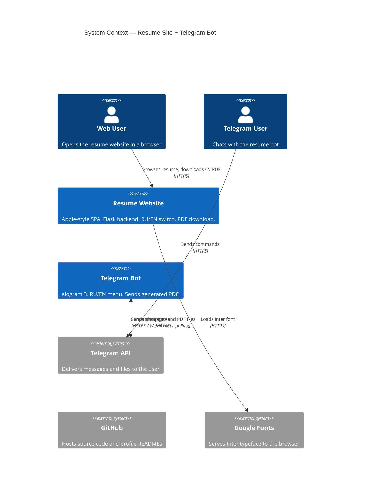
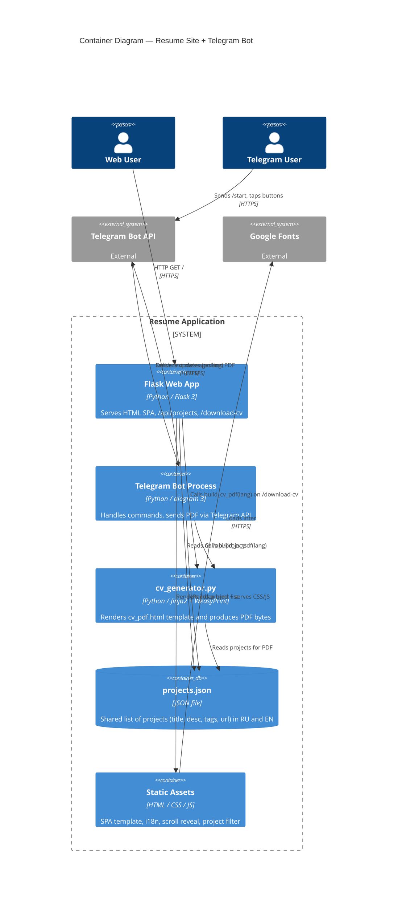
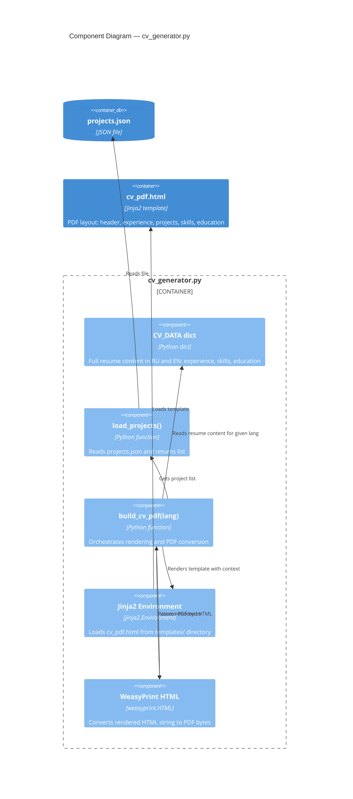
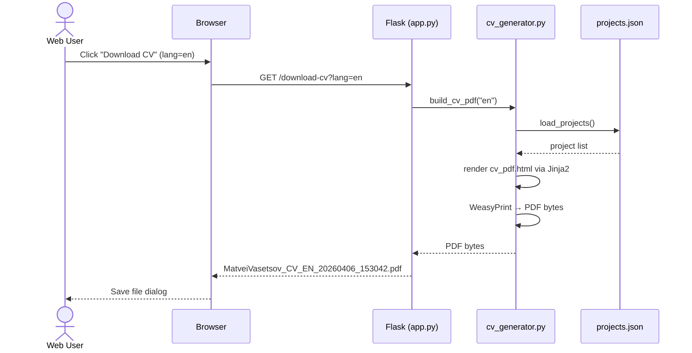
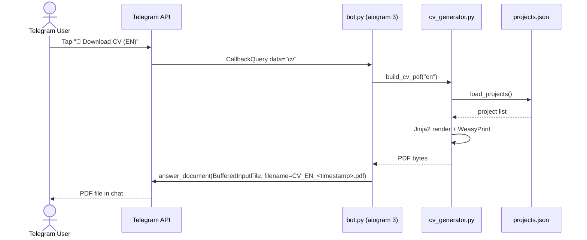
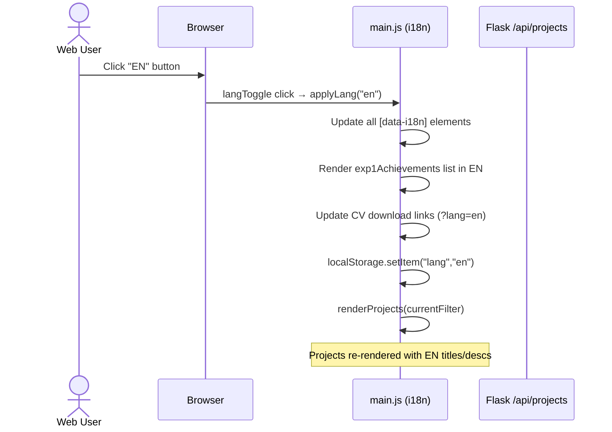
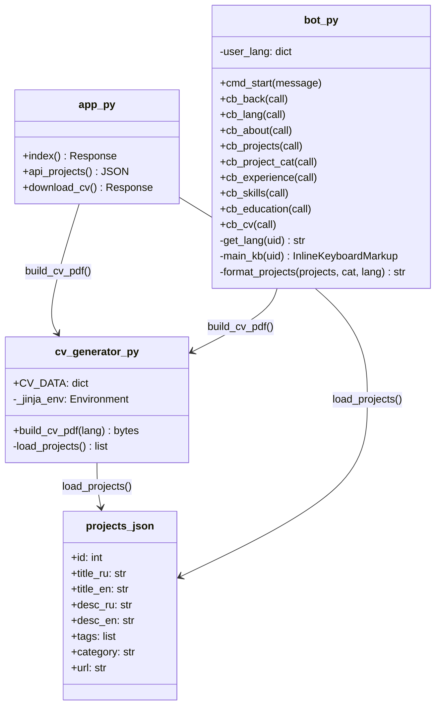

# Resume Site + Telegram Bot

Apple-style resume website (Flask) + Telegram bot (aiogram 3) with bilingual RU/EN interface, on-the-fly PDF generation via WeasyPrint, and a shared `projects.json` data source.

**Repository:** [github.com/MatveiV/Resume_site_bot](https://github.com/MatveiV/Resume_site_bot)

---

## Architecture — C4 Level 1 (System Context)



---

## Architecture — C4 Level 2 (Container)



---

## Architecture — C4 Level 3 (Component — cv_generator)



---

## Sequence — Web User Downloads CV



---

## Sequence — Telegram User Downloads CV



---

## Sequence — Language Switch (Website)



---

## Class Diagram — Key Modules



---

## Project Structure

```
Resume_site_bot/
├── app.py               # Flask backend — routes: /, /api/projects, /download-cv
├── bot.py               # Telegram bot — aiogram 3, inline keyboards, i18n
├── cv_generator.py      # Standalone PDF generator (Jinja2 + WeasyPrint, no Flask context)
├── projects.json        # Shared project database (RU + EN, 12 projects)
├── requirements.txt
├── .env.example         # BOT_TOKEN placeholder
├── .gitignore
├── templates/
│   ├── index.html       # Single-page resume site (Apple dark theme)
│   └── cv_pdf.html      # Jinja2 template for PDF generation
└── static/
    ├── css/style.css    # Dark glassmorphism theme, animations, responsive
    ├── js/main.js       # i18n engine, project filter, scroll reveal, lang persistence
    └── cv/              # (optional) place static PDF fallbacks here
```

---

## Quick Start

```bash
# 1. Activate virtual environment
venv\Scripts\activate          # Windows
source venv/bin/activate       # Linux / macOS

# 2. Install dependencies
pip install -r requirements.txt

# 3. Configure environment
cp .env.example .env
# Edit .env — set BOT_TOKEN=<your token from @BotFather>

# 4. Run the website
python app.py
# → http://localhost:5000

# 5. Run the bot (separate terminal, venv activated)
python bot.py
```

---

## Feature Matrix

| Feature | Website | Telegram Bot |
|---------|---------|--------------|
| RU / EN language switch | ✅ Button in nav, persisted in localStorage | ✅ Inline keyboard button |
| Generate CV PDF on-the-fly | ✅ `/download-cv?lang=ru\|en` | ✅ Sends `BufferedInputFile` |
| Timestamp in CV filename | ✅ `CV_RU_20260406_153000.pdf` | ✅ Same format |
| Project list from JSON | ✅ `/api/projects` → JS render | ✅ Category menu |
| Filter projects by category | ✅ Filter bar (AI/LLM, Infra, ML) | ✅ 3 category buttons |
| Direct GitHub repo links | ✅ Per project card | ✅ Per project in list |
| Brand icons (Yahoo/TG/GH/LI) | ✅ SVG inline in contacts | ✅ Emoji + label |
| Scroll reveal animations | ✅ IntersectionObserver | — |
| Responsive layout | ✅ CSS Grid, mobile nav hidden | — |

---

## Tech Stack

| Layer | Technology |
|-------|-----------|
| Web backend | Python 3.10+, Flask 3.x |
| Telegram bot | aiogram 3.x, python-dotenv |
| PDF generation | WeasyPrint, Jinja2 |
| Frontend | Vanilla HTML / CSS / JS, Inter font |
| Data | JSON (projects.json) |
| Diagrams | Mermaid (C4, Sequence, Class) |

---

## Adding / Editing Projects

Edit `projects.json` — no server restart needed. Schema:

```json
{
  "id": 13,
  "title_ru": "Название проекта",
  "title_en": "Project Title",
  "desc_ru": "Описание на русском.",
  "desc_en": "Description in English.",
  "tags": ["Python", "FastAPI"],
  "category": "AI / LLM",
  "url": "https://github.com/MatveiV/repo-name"
}
```

Valid categories: `AI / LLM` · `Infrastructure` · `ML / Finance`
